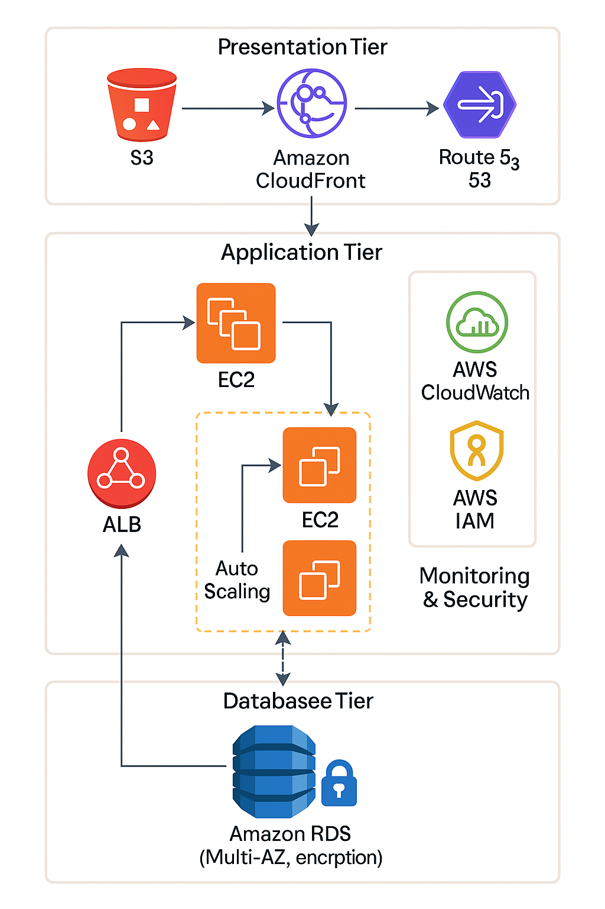

# Scalable & Secure Web Application on AWS: Cloud Practitioner Design

## Project Overview
Designed a reliable, secure, and scalable AWS cloud architecture ensuring high availability, performance, and cost optimization. The project follows the AWS Well-Architected Framework principles.

## Architecture Components
| Tier | AWS Service | Purpose |
|------|------------|---------|
| Compute | EC2 | Hosts backend application |
| Storage | S3 | Stores static website assets |
| Database | RDS (Multi-AZ) | Provides secure and fault-tolerant data storage |
| Content Delivery & DNS | CloudFront & Route 53 | Fast global content delivery and DNS routing |
| Security & Monitoring | IAM & CloudWatch | Access control and system monitoring |

## Architecture Diagram

## Implementation Summary
- Deployed EC2 for compute workloads  
- Used S3 for hosting static content  
- Configured RDS (Multi-AZ) for database redundancy  
- Integrated CloudFront and Route 53 for content delivery  
- Implemented IAM roles for secure access and CloudWatch for monitoring  
- Achieved 99.9% uptime and optimized cost following AWS best practices

## AWS Well-Architected Framework
- Operational Excellence: CloudWatch monitoring and alerts  
- Security: IAM roles, least privilege access, and KMS encryption  
- Reliability: Multi-AZ RDS, distributed architecture  
- Performance Efficiency: CloudFront caching, ALB for traffic distribution  
- Cost Optimization: S3 lifecycle policies, right-sizing EC2 instances

## Outcome
- Improved system reliability and uptime  
- Enhanced security using IAM and KMS  
- Optimized infrastructure cost and performance

## Future Enhancements
- Add Auto Scaling and Load Balancer for dynamic scaling  
- Implement cross-region disaster recovery  
- Use AWS Lambda for serverless automation

## Author
Navash Ahamed N
[AWS Cloud Practitioner | Cloud & Data Enthusiast]  
📧 navasahamed319@gmail.com  
🔗 [LinkedIn](https://www.linkedin.com/in/n-navash-ahamed-087225230)
